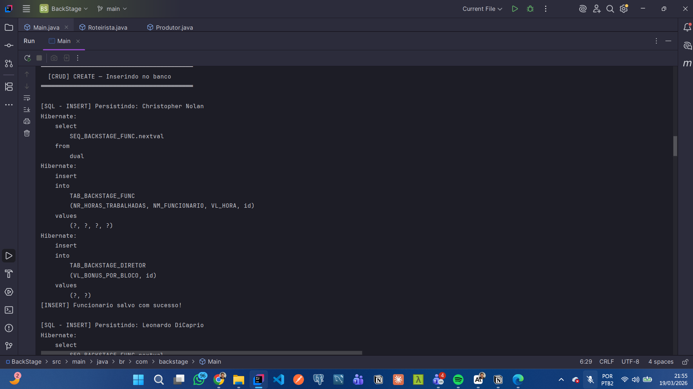
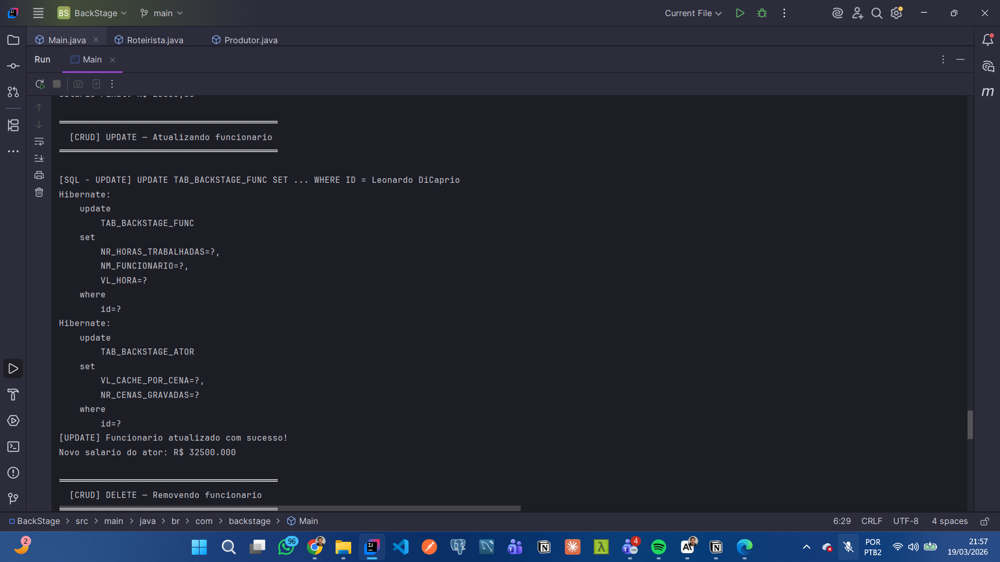
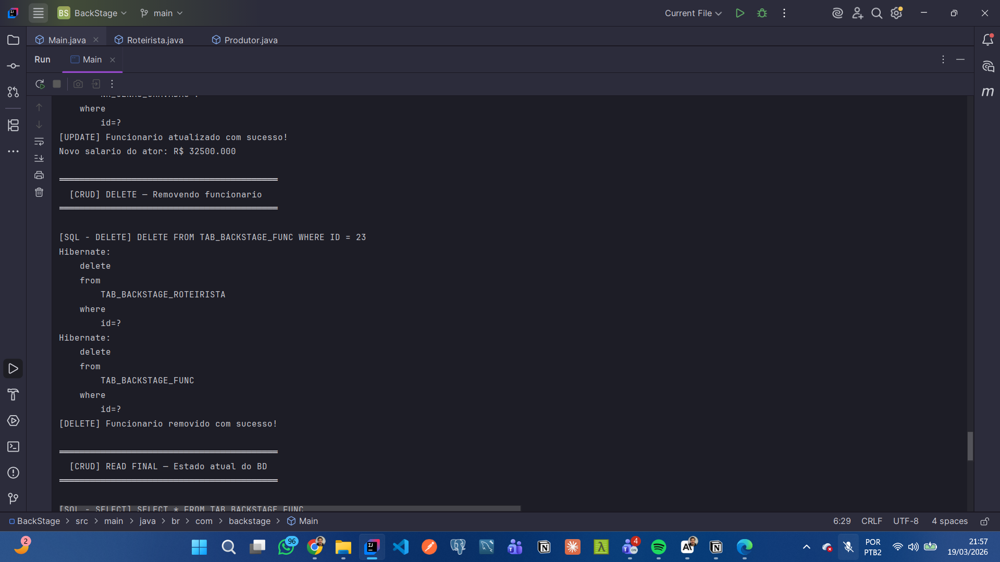

# 🎬 BackStage — RH de uma Produtora
 
> Checkpoint 1 — Java Advanced | FIAP — Análise e Desenvolvimento de Sistemas  
> Professor: Dr. Marcel Stefan Wagner
 
---
 
## 👥 Integrantes
 
| Nome | RM |
|------|----|
| Olavo Port Neves | RM563558 |
| Pedro H. França  | RM561940 |
| Luiz Gonçalves   | RM564495 |
 
---
 
## 📋 Sobre o Projeto
 
O **BackStage** é um sistema de gestão de RH para uma produtora cinematográfica, desenvolvido em Java com JPA, Hibernate e Oracle SQL Developer.
 
O sistema gerencia diferentes perfis de funcionários da produtora — Diretores, Atores, Roteiristas e Produtores — com cálculo de salário individualizado para cada perfil, persistência no banco de dados Oracle e geração automática de SQL via Java Reflection API.
 
---
 
## 🏗️ Estrutura do Projeto
 
```
src/main/java/br/com/backstage/
├── annotation/
│   ├── Coluna.java           # Annotation customizada para colunas
│   └── Descricao.java        # Annotation customizada para tabelas
├── model/
│   ├── Funcionario.java      # Classe base
│   ├── DiretorSenior.java    # Subclasse — bônus a cada 15h trabalhadas
│   ├── Ator.java             # Subclasse — cachê por cena gravada
│   ├── Roteirista.java       # Subclasse — pagamento por página entregue
│   └── Produtor.java         # Subclasse — comissão sobre orçamento gerenciado
├── repository/
│   └── TabelaFuncionarios.java  # CRUD + Reflection gerando SQL
└── Main.java                 # Ponto de entrada — executa o CRUD completo
 
src/main/resources/META-INF/
└── persistence.xml           # Configuração JPA 2.1 + Hibernate + Oracle
```
 
---
 
## ✨ Funcionalidades
 
- **Herança entre classes** com cálculo de salário polimórfico
- **Annotations customizadas** `@Descricao` e `@Coluna`
- **Java Reflection API** gerando código SQL automaticamente (`SELECT`, `CREATE TABLE`)
- **CRUD completo** com log do SQL em cada etapa:
  - `CREATE` — `INSERT INTO`
  - `READ` — `SELECT * FROM`
  - `UPDATE` — `UPDATE SET`
  - `DELETE` — `DELETE FROM`
- **JPA 2.1** com `javax.persistence`
- **Hibernate 5** como provedor JPA
- **Oracle SQL Developer** como banco de dados
 
---
 
## 💰 Lógica de Salário por Perfil
 
| Perfil | Cálculo |
|--------|---------|
| `Funcionario` | Horas trabalhadas × Valor/hora |
| `DiretorSenior` | Base + bônus a cada 15h trabalhadas |
| `Ator` | Base + cachê por cena gravada |
| `Roteirista` | Base + valor por página entregue |
| `Produtor` | Base + 0,5% do orçamento gerenciado |
 
---
 
## 🗄️ Tabelas no Oracle
 
| Classe | Tabela Oracle |
|--------|--------------|
| `Funcionario` | `TAB_BACKSTAGE_FUNC` |
| `DiretorSenior` | `TAB_BACKSTAGE_DIRETOR` |
| `Ator` | `TAB_BACKSTAGE_ATOR` |
| `Roteirista` | `TAB_BACKSTAGE_ROTEIRISTA` |
| `Produtor` | `TAB_BACKSTAGE_PRODUTOR` |
 
---
 
## ▶️ Como Executar
 
### Pré-requisitos
- Java 21
- Maven
- Acesso ao Oracle FIAP (`oracle.fiap.com.br:1521`)
 
### Configuração
1. Abra o arquivo `src/main/resources/META-INF/persistence.xml`
2. Substitua as credenciais:
```xml
<property name="javax.persistence.jdbc.user"     value="SEU_RM"/>
<property name="javax.persistence.jdbc.password" value="SUA_SENHA"/>
```
 
### Execução
1. Clone o repositório
2. Abra no IntelliJ IDEA
3. Aguarde o Maven baixar as dependências
4. Execute a classe `Main.java`
 
As tabelas serão criadas automaticamente no Oracle via `hibernate.hbm2ddl.auto=update`.
 
---

## 📸 Evidências de Execução
 
### 🖥️ IDE — Execução do programa
 
#### Reflection gerando SQL automaticamente

 
#### CREATE — Insert no banco

 
#### READ — Select no banco

 
#### UPDATE — Atualização no banco

 
#### DELETE — Remoção no banco

 
---
 
### 🗄️ Oracle SQL Developer — Comprovação no banco
 
#### Tabelas criadas automaticamente pelo Hibernate
<!-- Adicione aqui o print das tabelas no Oracle -->

 
#### Registros inseridos
<!-- Adicione aqui o print dos registros no Oracle após o INSERT -->

 
#### Registro atualizado
<!-- Adicione aqui o print do registro atualizado no Oracle -->

 
#### Registro removido
<!-- Adicione aqui o print confirmando o DELETE no Oracle -->

 
---
 
## 🛠️ Tecnologias
 


